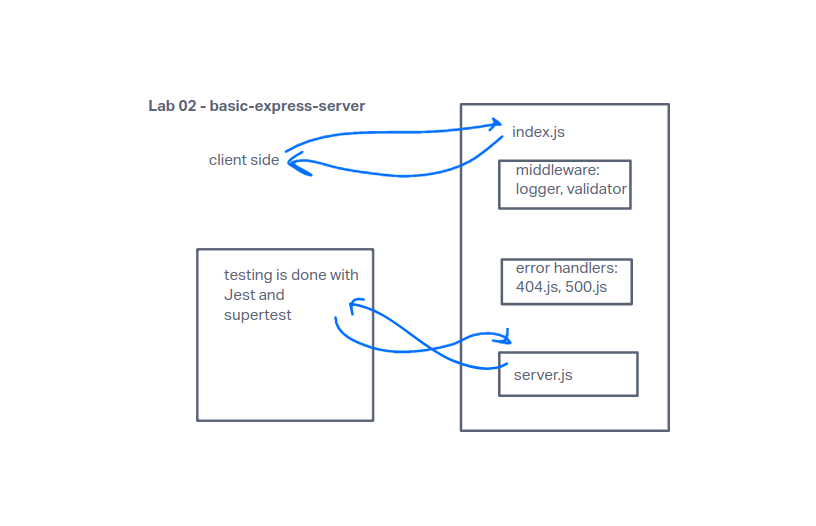

# basic-express-server
Code Fellows 401 Module 1, lab02 server

Lab02 Project: Basic Express Server 
Author: Kyle Freemantle
Problem Domain: From a business requirements standpoint, we will be building a basic Express server using best practices, including server modularization, use of middleware, and tests.

Links and Resources

[GitHub Actions](https://github.com/kfreemantle/basic-express-server/actions)
[GitHub PR](https://github.com/kfreemantle/basic-express-server/pull/2)
[back-end server url](https://basic-express-server-01ik.onrender.com)

Setup .env requirements (where applicable): PORT included in .env file.

#### UML

